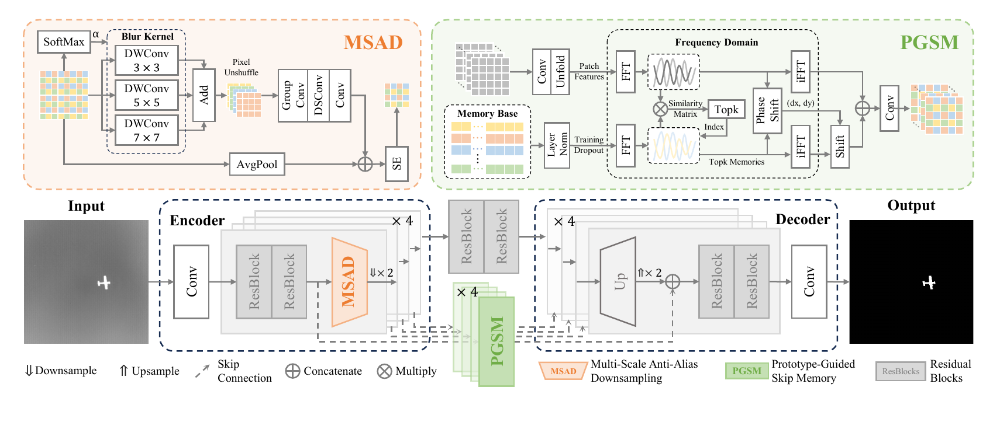
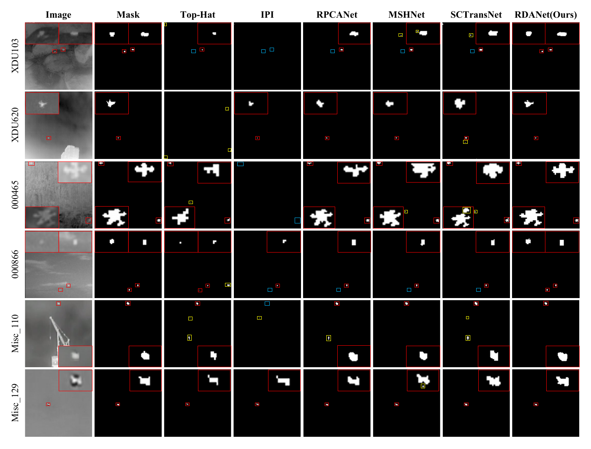

<div align="center">

# RDANet: Relative Degradation Aware Network for Infrared Small Target Detection

Official PyTorch implementation of the paper accepted by  
**IEEE Transactions on Geoscience and Remote Sensing (TGRS)**

Rui Liu, Jing Nie, and Ying Fu

</div>

## Overview

Infrared small target detection is challenged by large target-scale variation and strong background interference. RDANet addresses these coupled degradations with a compact encoder-decoder architecture built around two components:

- **Multi-Scale Anti-Alias Downsampling (MSAD)** adaptively aggregates multiple receptive fields before downsampling, preserving target morphology while suppressing aliasing and background leakage.
- **Prototype-Guided Skip Memory (PGSM)** retrieves representative prototypes in the frequency domain and aligns them through phase correlation, stabilizing local target contrast across diverse scenes.

<p align="center">
  
</p>

## Quantitative Results and Pretrained Models

The following results are reported in the accepted paper. IoU and detection probability (P<sub>d</sub>) are percentages; false-alarm rate (F<sub>a</sub>) is reported in 10<sup>-6</sup>.

| Dataset | IoU (%) | P<sub>d</sub> (%) | F<sub>a</sub> (10<sup>-6</sup>) | Pretrained models |
|:--|--:|--:|--:|:--:|
| IRSTD-1k | **73.82** | **93.60** | **7.67** | [Google Drive](https://drive.google.com/file/d/1uoLl2KTLRL6En_t1Uc-lkZJQQXs2yCG8/view?usp=drive_link) · [OneDrive](https://1drv.ms/u/c/206ceab89badeb0d/IQDjKabcQh_KS6el6TZgzTCfAVV6giSTLoImhbycrj6ULQ8?e=eHmRb9) |
| NUDT-SIRST | **95.43** | **99.47** | **2.90** | [Google Drive](https://drive.google.com/file/d/1CjCNrublTJl2_3nIGezbrz0u4zkl24Au/view?usp=drive_link) · [OneDrive](https://1drv.ms/u/c/206ceab89badeb0d/IQB1Dk_6uUgKTIwL7YEG_LrGAVLA0I1waVDD8B-cp4lV0ps?e=0FavPi) |
| NUAA-SIRST | **79.33** | **100.00** | **1.91** | [Google Drive](https://drive.google.com/file/d/1uReY-PB3rRCoemxUwgUq37eruhQpL2cd/view?usp=drive_link) · [OneDrive](https://1drv.ms/u/c/206ceab89badeb0d/IQBtkWIzY-OKSIsHCMziBJ_yAecyx0ubEnld4hkEUxX2P8U?e=hOvjkm) |

## Comparison Methods

The repositories of the deep-learning methods compared in the paper are listed below.

| Method | Venue | Repository |
|:--|:--:|:--|
| MDvsFA | ICCV 2019 | [wanghuanphd/MDvsFA_cGAN](https://github.com/wanghuanphd/MDvsFA_cGAN) |
| ACM | WACV 2021 | [YimianDai/open-acm](https://github.com/YimianDai/open-acm) |
| DNANet | TIP 2023 | [YeRen123455/Infrared-Small-Target-Detection](https://github.com/YeRen123455/Infrared-Small-Target-Detection) |
| ISNet | CVPR 2022 | [RuiZhang97/ISNet](https://github.com/RuiZhang97/ISNet) |
| UIU-Net | TIP 2023 | [danfenghong/IEEE_TIP_UIU-Net](https://github.com/danfenghong/IEEE_TIP_UIU-Net) |
| MSHNet | CVPR 2024 | [ying-fu/MSHNet](https://github.com/ying-fu/MSHNet) |
| SCTransNet | TGRS 2024 | [xdFai/SCTransNet](https://github.com/xdFai/SCTransNet) |
| RPCANet | WACV 2024 | [fengyiwu98/RPCANet](https://github.com/fengyiwu98/RPCANet) |
| L²SKNet | TGRS 2025 | [fengyiwu98/L2SKNet](https://github.com/fengyiwu98/L2SKNet) |
| MMLNet | TGRS 2025 | [qianngli/MMLNet](https://github.com/qianngli/MMLNet) |
| MSDA-Net | TGRS 2025 | [YuChuang1205/MSDA-Net](https://github.com/YuChuang1205/MSDA-Net) |
| Text-IRSTD | ICCV 2025 | [Zhengsy0407/Text-IRSTD](https://github.com/Zhengsy0407/Text-IRSTD) |

## Qualitative Results

Red boxes mark correctly detected targets, yellow boxes indicate false alarms, and cyan boxes indicate missed targets.

<p align="center">
  
</p>

## Installation

The code requires Python, PyTorch, and a CUDA-capable GPU. Install the remaining dependencies with:

```bash
pip install -r requirements.txt
```

For a CUDA-specific PyTorch build, follow the installation command provided for your CUDA version before installing the remaining packages.

## Dataset Preparation

Place the three datasets under one root directory. Each text file contains image identifiers without filename extensions.

```text
datasets/
├── IRSTD-1k/
│   ├── images/
│   ├── masks/
│   ├── trainval.txt
│   └── test.txt
├── NUDT-SIRST/
│   ├── images/
│   ├── masks/
│   ├── trainval.txt
│   └── test.txt
└── NUAA-SIRST/
    ├── images/
    ├── masks/
    ├── trainval.txt
    └── test.txt
```

Images and masks are expected to have matching `.png` filenames. All samples are processed at 512 x 512 resolution.

## Training

Use `--dataset-name` to select a dataset and `--data-root` to specify the common dataset root. For example:

```bash
python main.py \
  --mode train \
  --dataset-name IRSTD-1k \
  --data-root ./datasets \
  --save-root ./runs \
  --batch-size 4 \
  --epochs 1000 \
  --lr 1e-3
```

Replace `IRSTD-1k` with `NUDT-SIRST` or `NUAA-SIRST` to train on the other datasets. Dataset-specific PGSM settings are selected automatically.

## Evaluation

Download the corresponding checkpoint from the table above and run:

```bash
python main.py \
  --mode test \
  --dataset-name IRSTD-1k \
  --data-root ./datasets \
  --weight-path ./weights/IRSTD-1k.pkl
```

Examples for the other datasets:

```bash
python main.py --mode test --dataset-name NUDT-SIRST --data-root ./datasets --weight-path ./weights/NUDT-SIRST.pkl
python main.py --mode test --dataset-name NUAA-SIRST --data-root ./datasets --weight-path ./weights/NUAA-SIRST.pkl
```

The evaluation reports IoU, normalized IoU, P<sub>d</sub>, F<sub>a</sub>, ROC statistics, and target-size-binned IoU.

## Repository Structure

```text
.
├── assets/                 # Figures used by this README
├── model/
│   ├── modules/
│   │   ├── msad.py         # Multi-Scale Anti-Alias Downsampling
│   │   └── pgsm.py         # Prototype-Guided Skip Memory
│   └── rdanet.py           # RDANet architecture
├── utils/
│   ├── data.py             # Dataset loading and preprocessing
│   ├── losses.py           # Training losses
│   └── metric.py           # Evaluation metrics
├── main.py                 # Training and evaluation entry point
└── requirements.txt
```

## Citation

If this work is useful for your research, please cite:

```bibtex
@article{liu2026rdanet,
  title   = {RDANet: Relative Degradation Aware Network for Infrared Small Target Detection},
  author  = {Liu, Rui and Nie, Jing and Fu, Ying},
  journal = {IEEE Transactions on Geoscience and Remote Sensing},
  year    = {2026}
}
```

## Contact

For questions, please contact Rui Liu at `liurui25@bit.edu.cn`.
